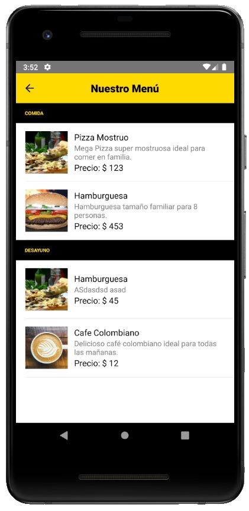
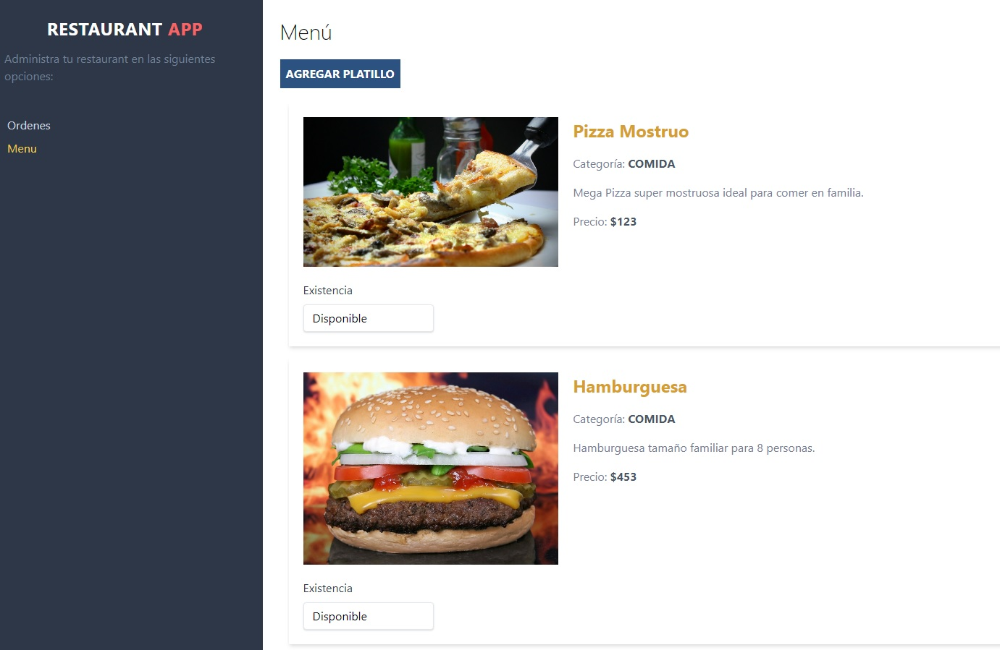

# WebApp y App Nativa para Restaurant realizada con React Hooks, React Native, Firebase y Tailwind Css

Proyecto completo desarrollado con React. Con un panel web para administrar los pedidos y el menú de un restaurant.
Se conecta con una app para clientes desarrollada con React Native, que permite realizar ordenes y saber el tiempo de preparación.

## Herramientas utilizadas:
- React Hooks
- React Native
- React Native Navigation
- Native Base
- Firebase
- Tailwind Css
- Formik

## Pasos a seguir:

- Para comenzar ejecute:
`npm install`

- Para ejecutar la WebApp ejecute:
`restaurantcliente/ npm start`

- Para ejecutar la App para Android utilize este comando:
`restaurantapp/ npx react-native run-android`

- Para ejecutar la App para IOS utilize este comando:
`restaurantapp/ npx react-native run-ios`

- En la carpeta firebase (del proyecto restaurantcliente) modifique el archivo: config.js por sus propias credenciales.

## Vista Previa de la App:

## Vista Previa de la Web App:

