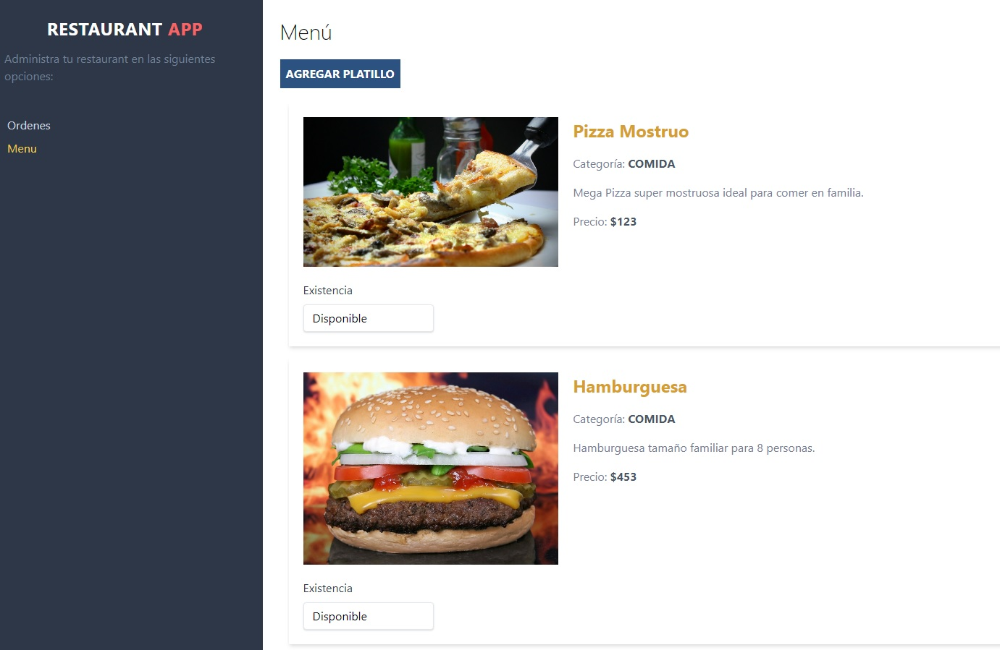

# WebApp para Restaurant realizada con React Hooks, Firebase y Tailwind Css

Esta webapp tiene conexión con una App para clientes realizada en ReactNative (se encuentra en este repositorio: restaurantapp)

## Herramientas utilizadas:
- React Hooks
- Firebase
- Tailwind Css
- Formik

## Pasos a seguir:

- Para comenzar ejecute:
`npm install`

- En la carpeta firebase modifique el archivo: config.js por sus propias credenciales.

## Vista Previa:

